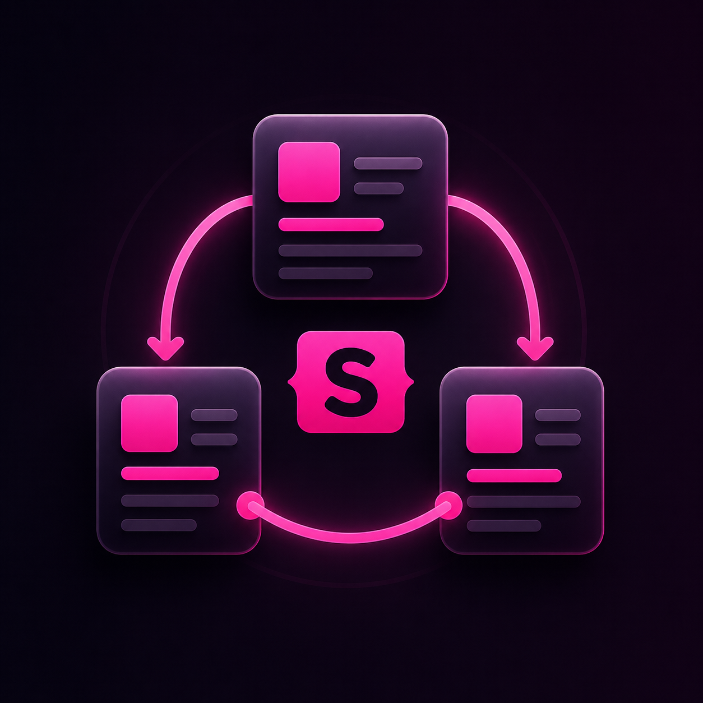
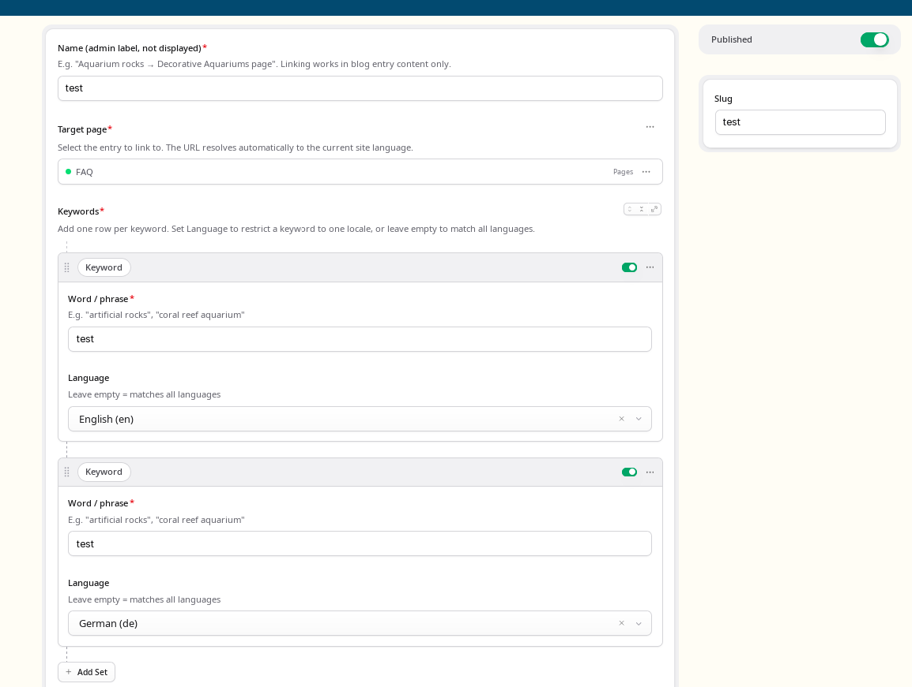
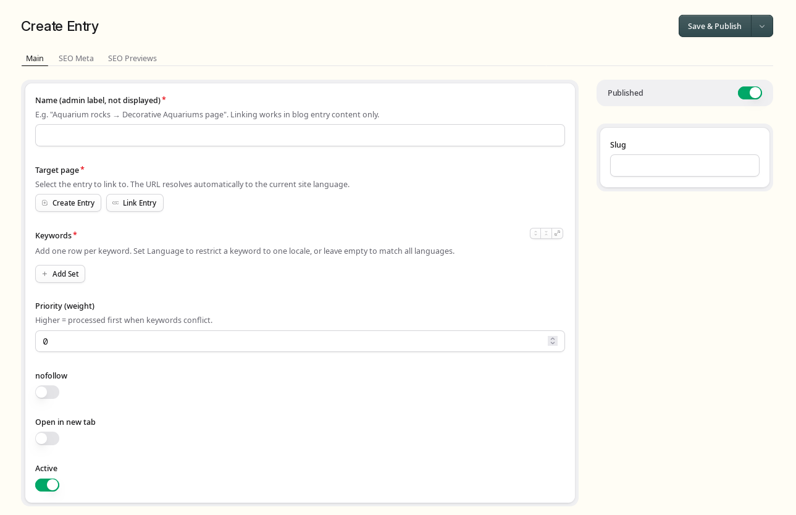

# Blog Internal Linking for Statamic



A Statamic 6 addon for automatic keyword-based internal linking in blog content.

Works at render time via an Antlers modifier. Uses a native Statamic `internal_links` collection as storage for keyword → entry mappings. Supports per-locale keywords in a single entry — no multisite propagation required.

## Requirements

- PHP 8.2+
- Laravel 11+
- Statamic 6+

## Installation

```bash
composer require 5k18a/blog-internal-links
php artisan internal-links:install
```

The install command:
- Publishes `config/internal-links.php`
- Creates `content/collections/internal_links.yaml`
- Publishes the blueprint to `resources/blueprints/collections/internal_links/`
- **Auto-detects** your blog collection by scanning collection handles for keywords like `blog`, `post`, `articles`, `news`
- On multisite installs, asks which site you use to manage content in the CP
- Writes detected values into `config/internal-links.php`
- Runs `php artisan statamic:stache:refresh`

### Manual install (alternative)

```bash
composer require 5k18a/blog-internal-links
php artisan vendor:publish --tag=internal-links-config
php artisan vendor:publish --tag=internal-links-collection
php artisan vendor:publish --tag=internal-links-blueprints
php artisan statamic:stache:refresh
```

## Configuration

After install, review `config/internal-links.php`:

```php
return [
    'blog_collection' => 'blog',  // handle of your blog collection
    'admin_site'      => 'en',    // site used to manage internal_links in CP
];
```

## Usage

Add the modifier inside your blog Antlers template, within the Bard field loop:

```antlers
{{ content }}
    {{ if type == "quote_section" }}
        {{-- handle quote --}}
    {{ else }}
        {{ text | apply_internal_links }}
    {{ /if }}
{{ /content }}
```

The modifier also works on any string or HTML field:

```antlers
{{ free_text_content | apply_internal_links }}
{{ wysiwyg_html | apply_internal_links }}
```

## Managing Internal Links

Go to **CP → Collections → Blog Internal Linking** and create one entry per target page.

Each keyword row in the replicator has two fields:
- **Word / phrase** — the text to match (case-insensitive)
- **Language** — optional locale code (`en`, `de`, `fr`, …). Leave empty to apply to all languages.

Example configuration for one entry:

| Keyword | Language |
|---|---|
| sztuczne skały | pl |
| artificial rocks | en |
| Kunstfelsen | de |
| roches artificielles | *(empty — all)* |

The modifier automatically:
1. Filters keywords for the current site locale
2. Resolves the target entry URL to the correct language version via Statamic's native multisite URL resolution

## Behaviour

- Only active (`enabled: true`) entries from the `internal_links` collection are processed.
- The modifier only runs on entries belonging to the `blog_collection` defined in config — all other pages are skipped silently.
- The target URL resolves to the current site's language automatically.
- Existing links, headings, figures, images, iframes, and WordPress embed comments are protected from replacement.
- Matching is case-insensitive and respects Unicode word boundaries.
- Higher `weight` means earlier processing when keywords conflict.
- **Deduplication:** each target URL is linked at most once per page request.

## Blueprint Fields

- `target_entry` — entries picker (pages, services, projects)
- `keywords` — replicator with `keyword` (text) and `locale` (select, optional)
- `weight` — processing priority (higher = first)
- `nofollow` — toggle
- `open_in_new_window` — toggle
- `enabled` — toggle

## Screenshots




## Example

Mapping:
- keyword: `coral reef`
- target entry: `artificial-coral-reef` (URL: `/offer/artificial-coral-reef`)

Content:
```html
<h2>coral reef in a heading</h2>
<p>Build a coral reef for your aquarium.</p>
```

Output:
```html
<h2>coral reef in a heading</h2>
<p>Build a <a href="/offer/artificial-coral-reef">coral reef</a> for your aquarium.</p>
```

Headings are protected from replacement. Only the first occurrence of each target URL is linked per page.

## License

This is a **commercial addon** for Statamic CMS. A valid license purchased through
the [Statamic Marketplace](https://statamic.com/addons) is required per site.

See [LICENSE](LICENSE) for full terms.

## Roadmap

- Variant A (current): runtime modifier + HTML parser + CP collection storage
- Variant B: global settings, per-entry exclusions, pre-computation
- Variant C: link logs, custom CP panel, auto-link suggestions, import/export
